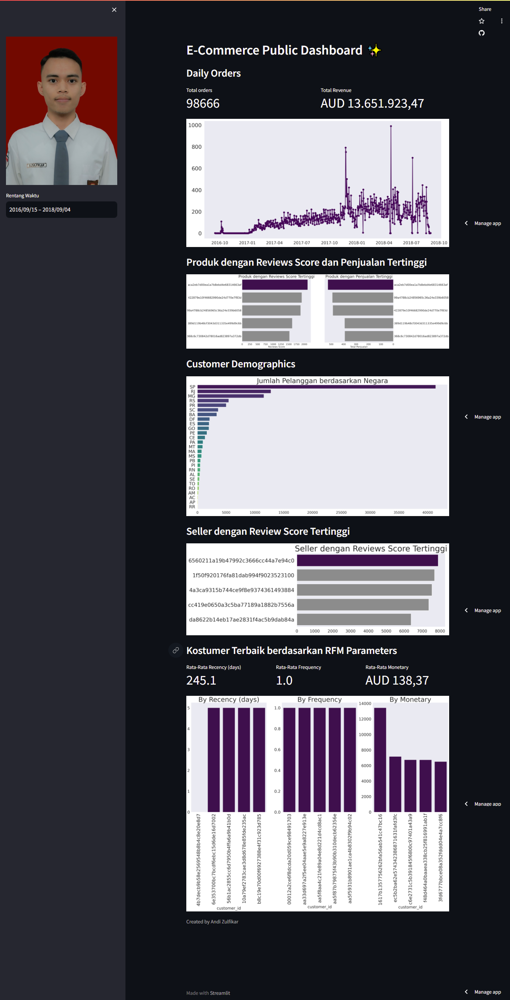

# E-commerce 
## Setup environment 
```
pipenv install
pipenv shell
pip install numpy pandas scipy matplotlib seaborn jupyter streamlit babel
```
## Run streamlit app
```
streamlit run dashboard.py
```

## Deployment Dashboard
link dashboard: [zulfikar-dashboard-e-commerce-submission](https://zulfikar-dashboard-e-commerce-submission.streamlit.app/)

## Screenshot Dashboard
